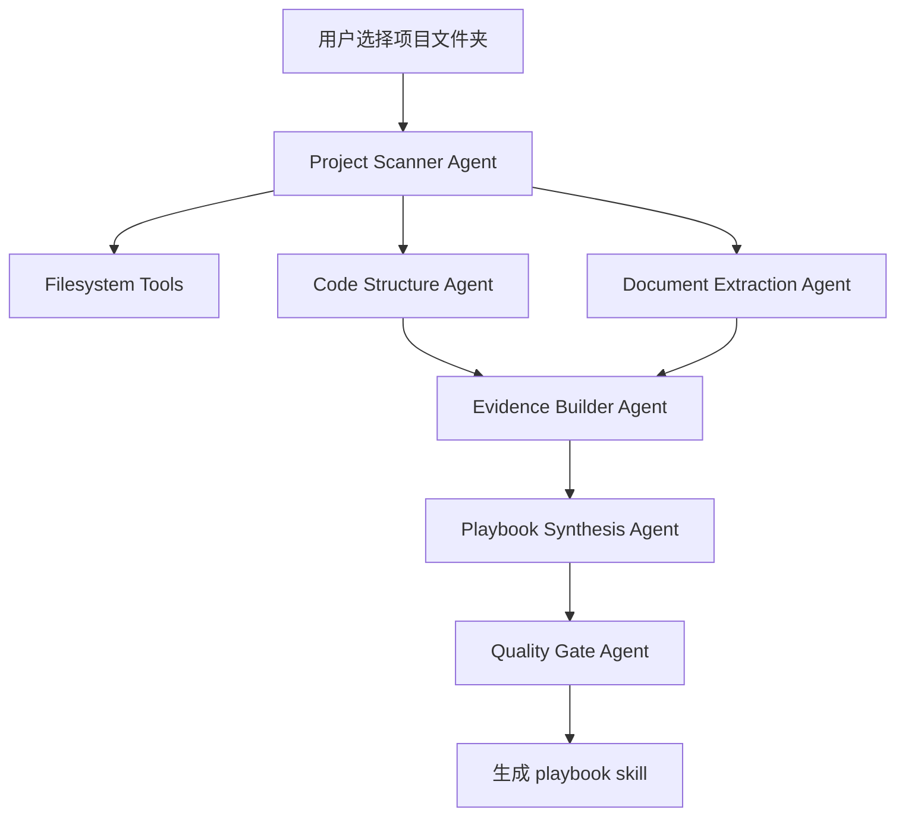
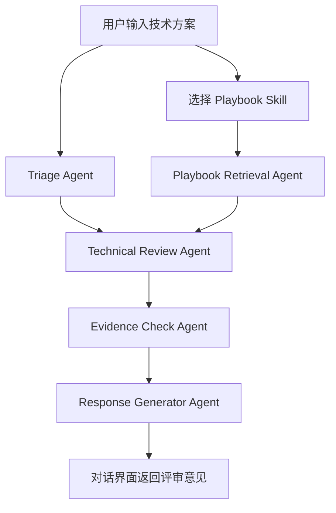

# AI 技术评审系统 PRD

版本: v0.2  
日期: 2026-05-07  
技术栈: OpenAI Agents SDK, Python, FastAPI, PostgreSQL, pgvector, React/Next.js, OpenAI-compatible Model Adapter

## 1. 背景

团队在设计新功能、重构模块、引入依赖、调整架构边界时，通常缺少一套可复用的工程判断协议。代码库中的 README、设计文档、目录结构、测试、配置和历史实现已经隐含了大量维护共识，但这些共识没有被结构化沉淀。

本系统借鉴 `oss-skill` 的核心原理：从代码、文档和工程痕迹中提炼可运行的工程判断，而不是做泛泛总结。MVP 聚焦本地项目文件夹：用户选择一个项目目录，系统读取项目文档和代码库，蒸馏生成该项目的评审 playbook skill。之后用户在对话界面输入技术方案，选择对应 playbook skill，系统返回基于该项目工程判断的技术评审意见。

## 2. 产品目标

### 2.1 目标

- 支持用户选择本地项目文件夹，自动分析代码库和项目文档。
- 基于 `oss-skill` 方法生成项目级评审 playbook skill。
- 在对话界面中，用户可选择某个 playbook skill 对技术方案进行评审。
- 输出结构化评审意见：结论、依据、风险、建议改法、验证要求、证据等级。
- 支持 OpenAI API 以及其他 OpenAI-compatible 协议大模型。

### 2.2 非目标

- MVP 不做代码评审、diff review、PR review。
- MVP 不接入 GitHub/GitLab，不处理 PR URL、issue、review comment。
- MVP 不自动修改代码。
- MVP 不做 IDE 插件。
- MVP 不做多人审批流和企业权限系统。
- MVP 不追求从互联网采集开源项目资料，只处理用户选择的本地项目文件夹。

## 3. 用户与场景

### 3.1 目标用户

- Tech Lead: 希望把项目工程判断沉淀成团队可复用的评审标准。
- 架构师: 希望评审技术方案是否符合现有系统边界和演化方向。
- 开发者: 希望在动手前检查方案是否会扩大复杂度、破坏抽象或遗漏验证。
- AI 工程工具使用者: 希望把一个项目快速转成可调用的评审 skill。

### 3.2 MVP 核心场景

1. 项目蒸馏  
   用户选择本地项目文件夹，系统读取代码、README、docs、配置、测试和关键模块，生成项目评审 playbook skill。

2. Playbook 管理  
   用户查看、编辑、启用、禁用和重新生成 playbook skill。

3. 技术方案评审  
   用户在对话框输入技术方案，选择一个项目 playbook skill，系统返回该方案是否符合项目工程判断、有哪些风险、需要补哪些验证。

4. 模型接入配置  
   用户配置 OpenAI API 或 OpenAI-compatible endpoint，例如自建网关、OpenRouter、兼容 Chat Completions 的模型服务。

## 4. 核心原则

### 4.1 oss-skill 原理映射

| oss-skill 原理 | MVP 产品化能力 |
| --- | --- |
| 代码优先 | 先读取目录结构、核心模块、测试、配置，再读取文档 |
| 多源采集 | 使用代码、README、docs、测试、配置、示例、ADR/RFC |
| 三重验证 | 规则需满足跨文件/跨模块复现、能指导新方案、有项目特异性 |
| 证据分级 | 输出区分 `confirmed`、`inferred`、`preference`、`unknown` |
| 开发任务映射 | 规则映射到新功能、重构、API/架构设计、性能、运维 |
| 诚实边界 | 证据不足时明确说明，不虚构项目维护者立场 |

### 4.2 技术方案评审原则

- 评审的是“方案是否适合这个项目”，不是通用好坏。
- 先给明确判断，再给证据和建议。
- 每条关键意见必须关联 playbook 规则或项目证据。
- 不把无法确认的问题写成阻塞结论。
- 输出必须包含下一步可执行动作。

## 5. MVP 功能需求

### 5.1 本地项目选择

**描述**: 用户在 Web 界面选择或输入本地项目文件夹路径。

需求：
- 支持选择一个项目根目录。
- 系统扫描目录，识别语言、框架、包管理器和文档位置。
- 支持配置忽略规则：
  - 默认忽略 `.git`、`node_modules`、`dist`、`build`、`.next`、`.venv`、`__pycache__`、日志、二进制文件。
  - 尊重 `.gitignore`。
  - 允许用户追加 ignore patterns。
- 展示扫描摘要：
  - 文件数量
  - 语言分布
  - 文档文件
  - 测试文件
  - 入口文件
  - 可能的敏感文件提示

优先级: P0

### 5.2 项目文档与代码库蒸馏

**描述**: 从本地项目中提炼项目级工程判断。

采集对象：
- 项目文档: README、docs、ADR、RFC、CHANGELOG、CONTRIBUTING。
- 代码结构: 目录边界、核心模块、接口层、服务层、数据层、配置层。
- 测试: 单元测试、集成测试、e2e、fixtures、测试工具。
- 工程配置: package manager、lint、format、tsconfig、pyproject、CI 配置、Dockerfile。
- 示例与脚本: examples、scripts、migrations、seed。

蒸馏维度：
- 架构边界: 模块如何分层、依赖方向是什么。
- API 规则: 对外接口、内部接口、类型约束、错误模型。
- 状态策略: 状态在哪里持有，如何避免全局状态和隐式耦合。
- 依赖策略: 什么时候引入依赖，依赖被隔离在哪里。
- 测试策略: 项目重视什么测试，哪些路径必须回归。
- 变更策略: 新功能、重构、配置变更应如何推进。
- 反模式: 项目中明确避免或已经清理过的模式。

输出：
- `playbook.skill.md`
- `evidence.jsonl`
- `project-summary.md`
- `rules.json`

优先级: P0

### 5.3 Playbook Skill 生成

**描述**: 生成可被对话评审工作流调用的项目评审 skill。

生成目录：

```text
data/playbooks/<project-slug>/
  playbook.skill.md
  project-summary.md
  rules.json
  evidence.jsonl
  metadata.json
```

`playbook.skill.md` 必须包含：
- skill 名称与适用项目。
- 激活规则。
- 核心维护共识。
- 决策启发式。
- 反模式。
- 技术方案评审流程。
- 不同任务类型的检查清单。
- 证据等级定义。
- 诚实边界。

`rules.json` 必须包含结构化规则：
- rule id
- rule name
- category
- severity default
- evidence ids
- applicability
- failure modes
- review prompts

优先级: P0

### 5.4 Playbook 管理

**描述**: 管理已生成的项目 playbook。

需求：
- 展示所有 playbook 列表。
- 支持查看 playbook 内容和证据来源。
- 支持重新蒸馏。
- 支持编辑规则标题、描述、适用范围、默认严重度。
- 支持启用/禁用规则。
- 支持版本记录：`v1`, `v2`, `v3`。
- 支持删除 playbook。

优先级: P0

### 5.5 对话式技术方案评审

**描述**: 用户输入技术方案，选择 playbook skill，系统返回评审意见。

输入：
- 技术方案文本。
- 选择的项目 playbook skill。
- 可选评审模式：
  - `quick`: 快速评审，只输出关键风险。
  - `standard`: 标准评审，输出完整结构化意见。
  - `strict`: 严格评审，偏向架构边界、迁移、测试、运维风险。

评审流程：
1. Triage Agent 判断方案类型：新功能、重构、架构调整、API 设计、依赖引入、性能优化、运维变更。
2. Playbook Agent 检索相关规则和证据。
3. Review Agent 按 playbook 规则评审方案。
4. Evidence Agent 校验关键结论是否有证据支撑。
5. Response Agent 生成对话式评审结果。

输出格式：
- 总体判断：`通过`、`有条件通过`、`建议修改后再评审`、`不建议采用`。
- 关键风险。
- 与项目 playbook 的冲突点。
- 建议改法。
- 必须补充的信息。
- 必须验证的测试/观测/回滚方案。
- 证据等级与引用。

优先级: P0

### 5.6 模型接入配置

**描述**: 支持 OpenAI 和其他 OpenAI-compatible 协议模型。

需求：
- 支持配置多个模型 provider。
- 每个 provider 包含：
  - provider name
  - base URL
  - API key
  - model name
  - API shape: `responses` 或 `chat_completions`
  - timeout
  - max retries
  - 是否启用 tracing
- 默认使用 OpenAI Agents SDK 的 OpenAI 模型路径。
- OpenAI-compatible endpoint 优先使用 Chat Completions 兼容路径。
- 支持不同 Agent 使用不同模型：
  - 蒸馏 Agent 可用高质量模型。
  - Triage Agent 可用低成本模型。
  - Evidence Agent 可用支持长上下文的模型。
- UI 支持测试连接。

优先级: P0

### 5.7 审计与追踪

**描述**: 每次蒸馏和评审可追溯。

需求：
- 保存任务输入、选用 playbook、模型 provider、Agent 调用链、工具调用、关键证据和最终输出。
- 私有模型或非 OpenAI endpoint 默认允许关闭外部 trace。
- 对敏感文件只保存路径和摘要，不保存原文片段。

优先级: P1

## 6. Agent 架构

系统基于 OpenAI Agents SDK 构建。Agents SDK 提供 Agent、tools、handoffs、guardrails、sessions、tracing 等原语；模型层支持默认 OpenAI provider，也支持通过 OpenAI-compatible endpoint 接入其他模型。

### 6.1 蒸馏工作流



### 6.2 方案评审工作流



### 6.3 Agent 职责

| Agent | 职责 | SDK 能力 |
| --- | --- | --- |
| Project Scanner Agent | 扫描文件、识别语言和文档 | function tools |
| Code Structure Agent | 提炼模块边界、依赖方向、核心接口 | specialist agent |
| Document Extraction Agent | 提炼 README/docs/ADR 中的显式规则 | specialist agent |
| Evidence Builder Agent | 建立证据索引和证据等级 | tools, structured output |
| Playbook Synthesis Agent | 生成 `playbook.skill.md` 和 `rules.json` | handoffs, structured output |
| Quality Gate Agent | 检查规则是否有证据、是否过泛化 | guardrails |
| Triage Agent | 判断技术方案类型和评审模式 | lightweight model |
| Playbook Retrieval Agent | 检索相关规则和证据 | tools |
| Technical Review Agent | 按 playbook 评审方案 | specialist agent |
| Evidence Check Agent | 校验关键结论证据等级 | guardrails |
| Response Generator Agent | 生成最终对话回复 | structured output |

### 6.4 Guardrails

输入 guardrails：
- 文件夹路径必须在用户授权范围内。
- 方案文本中的 prompt injection 不得覆盖系统规则。
- 模型 provider 配置不得在输出中泄露。

输出 guardrails：
- 高严重度结论必须关联 playbook rule 或明确说明证据不足。
- 不允许把 `unknown` 证据等级写成确定事实。
- 不输出敏感文件内容、密钥、token、私有配置值。

工具 guardrails：
- 文件系统工具默认只读。
- MVP 不提供写代码、提交代码、发布评论工具。

### 6.5 Tracing

工作流：
- `playbook_distillation`
- `technical_solution_review`
- `playbook_regeneration`

trace metadata：
- project slug
- playbook version
- model provider
- workflow mode
- file scan count
- evidence count

非 OpenAI provider 或私有部署场景下，允许禁用 OpenAI trace，仅保留本地审计日志。

## 7. 模型适配层

### 7.1 Provider 类型

| Provider 类型 | 适用场景 | 实现方式 |
| --- | --- | --- |
| OpenAI Responses | 默认 OpenAI 模型，工具能力和 tracing 最完整 | Agents SDK 默认模型路径 |
| OpenAI Chat Completions | 需要兼容 Chat Completions 的 OpenAI 模型 | `OpenAIChatCompletionsModel` |
| OpenAI-compatible endpoint | OpenRouter、自建网关、第三方兼容服务 | `AsyncOpenAI(base_url, api_key)` + Chat Completions model |
| Custom ModelProvider | 多 provider 路由或每次 run 定制 provider | Agents SDK `ModelProvider` |
| MultiProvider | 不同 Agent 使用不同模型/前缀路由 | Agents SDK `MultiProvider` |

### 7.2 能力约束

- 非 OpenAI 或 OpenAI-compatible Chat Completions 模型可能不支持 Responses API 特性。
- 结构化输出、工具调用、长上下文、usage 统计需要逐 provider 验证。
- 当 provider 不支持 OpenAI tracing 凭证时，应默认关闭远程 tracing。
- MVP 不承诺所有兼容 endpoint 行为一致，需提供连接测试和能力检测。

### 7.3 配置示例

```json
{
  "providers": [
    {
      "name": "openai-default",
      "type": "openai",
      "api_shape": "responses",
      "model": "gpt-5.4",
      "tracing_enabled": true
    },
    {
      "name": "openai-compatible-router",
      "type": "openai_compatible",
      "base_url": "https://example.com/v1",
      "api_shape": "chat_completions",
      "model": "provider/model-name",
      "tracing_enabled": false
    }
  ]
}
```

## 8. 数据模型

### 8.1 Project

```json
{
  "id": "proj_001",
  "name": "ThirdEye",
  "root_path": "F:/codebaby/ThirdEye",
  "slug": "thirdeye",
  "languages": ["python", "typescript"],
  "frameworks": ["fastapi", "react"],
  "created_at": "2026-05-07T10:00:00+08:00"
}
```

### 8.2 Playbook

```json
{
  "id": "pb_thirdeye_v1",
  "project_id": "proj_001",
  "name": "ThirdEye Review Playbook",
  "version": "1.0.0",
  "status": "active",
  "skill_path": "data/playbooks/thirdeye/playbook.skill.md",
  "rules_path": "data/playbooks/thirdeye/rules.json",
  "evidence_path": "data/playbooks/thirdeye/evidence.jsonl",
  "created_at": "2026-05-07T10:20:00+08:00"
}
```

### 8.3 Rule

```json
{
  "id": "rule_api_boundary_001",
  "category": "api_boundary",
  "name": "Public API changes must preserve the project boundary model",
  "default_severity": "major",
  "applicability": ["api_design", "architecture_change"],
  "description": "New interfaces should follow the existing service boundary and avoid leaking persistence details.",
  "evidence_ids": ["ev_001", "ev_014"],
  "failure_modes": ["data-layer leakage", "implicit coupling"],
  "enabled": true
}
```

### 8.4 Evidence

```json
{
  "id": "ev_001",
  "project_id": "proj_001",
  "source_type": "code|doc|test|config|example",
  "path": "src/services/user_service.ts",
  "symbol": "UserService",
  "summary": "Service layer owns user workflow orchestration; persistence details stay behind repository interfaces.",
  "evidence_level": "confirmed",
  "metadata": {
    "language": "typescript",
    "module": "services"
  }
}
```

### 8.5 Review Session

```json
{
  "id": "review_001",
  "playbook_id": "pb_thirdeye_v1",
  "mode": "standard",
  "input": "技术方案文本",
  "overall_judgement": "有条件通过",
  "findings": [],
  "model_provider": "openai-default",
  "created_at": "2026-05-07T11:00:00+08:00"
}
```

## 9. 用户流程

### 9.1 创建项目 Playbook

1. 用户进入“项目蒸馏”页面。
2. 选择本地项目文件夹。
3. 系统展示扫描摘要和忽略规则。
4. 用户点击“开始蒸馏”。
5. 系统执行蒸馏工作流。
6. 用户查看生成的 playbook skill、规则和证据。
7. 用户确认发布 playbook v1。

### 9.2 使用 Playbook 评审方案

1. 用户进入对话界面。
2. 选择项目 playbook skill。
3. 输入技术方案。
4. 选择评审模式。
5. 系统返回评审意见。
6. 用户可追问、要求展开证据、要求按某类风险重新评审。

### 9.3 重新蒸馏

1. 用户在 playbook 页面点击“重新蒸馏”。
2. 系统重新扫描项目文件夹。
3. 生成新版本候选。
4. 用户对比 v1/v2 差异。
5. 用户确认发布或放弃。

## 10. 界面需求

### 10.1 项目蒸馏页

- 文件夹选择器/路径输入框。
- 扫描摘要。
- 忽略规则编辑。
- 蒸馏进度：
  - 扫描项目
  - 读取文档
  - 分析代码结构
  - 构建证据
  - 生成 playbook
  - 质量检查
- 结果入口。

### 10.2 Playbook 详情页

- 项目摘要。
- 核心维护共识。
- 规则列表。
- 证据浏览器。
- 版本历史。
- 重新蒸馏按钮。
- 规则启用/禁用开关。

### 10.3 对话评审页

- Playbook selector。
- 模型 provider selector。
- 评审模式 selector。
- 技术方案输入框。
- 对话结果区域。
- 证据展开面板。
- 追问输入框。

### 10.4 模型设置页

- Provider 列表。
- 新增/编辑 provider。
- 连接测试。
- 能力检测结果：
  - tool calling
  - structured output
  - max context
  - streaming
  - usage reporting

## 11. 技术方案

### 11.1 后端

- Python 3.12
- FastAPI: API、任务管理、对话接口
- OpenAI Agents SDK: Agent 编排、tools、handoffs、guardrails、tracing
- PostgreSQL: 项目、playbook、规则、评审会话、模型 provider
- pgvector: 文档和代码证据检索
- Redis + RQ/Celery: 蒸馏异步任务
- tree-sitter 或语言服务器能力: 代码结构分析

### 11.2 前端

- React 或 Next.js
- 主要页面：
  - 项目蒸馏
  - Playbook 管理
  - 对话评审
  - 模型设置

### 11.3 本地文件工具

必须实现的 function tools：
- `scan_project_tree`
- `read_project_file`
- `detect_project_stack`
- `extract_document_chunks`
- `extract_code_symbols`
- `search_project_evidence`
- `write_playbook_artifact`
- `load_playbook_skill`
- `test_model_provider`

工具约束：
- 默认只读项目文件。
- 只允许写入应用数据目录 `data/playbooks/`。
- 不读取被 ignore 的文件。
- 不读取超过大小限制的文件，改用摘要提示。

### 11.4 推荐目录结构

```text
apps/
  api/
    app/
      agents/
      tools/
      guardrails/
      workflows/
      model_providers/
      services/
      schemas/
  web/
data/
  playbooks/
docs/
  ai-tech-review-system-prd.md
```

## 12. MVP 范围

### 12.1 P0

- 本地项目文件夹选择。
- 项目扫描和忽略规则。
- 项目文档与代码库蒸馏。
- 生成项目评审 playbook skill。
- Playbook 列表、详情、版本。
- 对话式技术方案评审。
- OpenAI 和 OpenAI-compatible 模型 provider 配置。
- 基础审计日志。

### 12.2 P1

- Playbook 规则手动编辑。
- 重新蒸馏版本对比。
- 更完整的证据浏览器。
- 多模型 Agent 分配策略。
- 本地 trace 查看。

### 12.3 P2

- GitHub/GitLab 接入。
- PR review / diff review。
- IDE 插件。
- 自动生成代码修改建议 patch。
- 团队协作与审批流。

## 13. 验收标准

### 13.1 项目蒸馏验收

- 给定一个本地项目文件夹，系统能完成扫描并生成 playbook skill。
- 扫描结果能正确识别主要语言、文档、测试和核心目录。
- playbook 至少包含：
  - 3 条核心维护共识
  - 5 条结构化规则
  - 3 条反模式
  - 证据列表
  - 技术方案评审流程
- 每条稳定规则至少关联 1 个项目证据；证据不足的规则必须标记为 `inferred` 或 `unknown`。

### 13.2 对话评审验收

- 用户能选择 playbook skill 并输入技术方案。
- 系统能在对话界面返回结构化评审意见。
- 输出必须包含总体判断、关键风险、建议改法、验证要求和证据等级。
- 用户追问“依据是什么”时，系统能展开对应规则和证据摘要。

### 13.3 模型接入验收

- OpenAI 默认 provider 可用。
- 至少一个 OpenAI-compatible Chat Completions endpoint 可配置并通过连接测试。
- provider 不支持某项能力时，UI 能明确提示能力缺口。
- 用户可为蒸馏和评审选择不同模型 provider。

### 13.4 安全验收

- 系统不读取 ignore 文件和超过限制的敏感文件。
- API key 不出现在日志、trace 和对话输出中。
- 文件系统工具不能写入项目源码目录。
- prompt injection 不能覆盖 playbook 规则和系统约束。

## 14. 指标

### 14.1 产品指标

- 10 万行以内项目的首次蒸馏 P95 < 20 分钟。
- 标准模式方案评审 P95 < 60 秒。
- 用户采纳或继续追问的评审会话占比 > 50%。
- 每个成熟 playbook 至少沉淀 20 条规则。

### 14.2 工程指标

- 蒸馏任务成功率 > 95%。
- 评审任务成功率 > 98%。
- 模型 provider 连接测试准确率 > 99%。
- 审计日志覆盖率 100%。

## 15. 风险与对策

| 风险 | 影响 | 对策 |
| --- | --- | --- |
| 代码库过大导致蒸馏慢 | 用户等待过久 | 增量扫描、文件大小限制、优先核心目录 |
| playbook 规则过泛 | 评审变成通用建议 | 要求项目证据、证据等级、质量检查 Agent |
| 文档和代码冲突 | 生成错误规则 | 并列呈现冲突，代码证据优先，标记诚实边界 |
| OpenAI-compatible 模型能力不一致 | 工具调用或结构化输出失败 | provider 能力检测、降级策略、模型白名单 |
| 本地敏感文件泄露 | 安全风险 | ignore 规则、secret scan、摘要化存储 |
| 用户技术方案信息不足 | 评审误判 | 输出“必须补充的信息”，不强行下结论 |

## 16. 开放问题

- 本地文件夹选择在桌面端、Web 端、CLI 端分别如何实现？
- MVP 是否需要支持 Windows/macOS/Linux 全平台路径权限？
- `playbook.skill.md` 是否需要兼容 Codex/Claude Code 等不同 skill 格式？
- 首批内置语言解析器优先级如何排序？
- 是否需要为不同项目模板提供预设蒸馏策略？

## 17. 参考

- `oss-skill` 本地仓库: `oss-skill/README-zh.md`
- `oss-skill` 方法论: `oss-skill/references/extraction-framework.md`
- OpenAI Agents SDK: https://openai.github.io/openai-agents-python/
- OpenAI Agents SDK Models: https://openai.github.io/openai-agents-python/models/
- OpenAI Agents SDK Guardrails: https://openai.github.io/openai-agents-python/guardrails/
- OpenAI Agents SDK Handoffs: https://openai.github.io/openai-agents-python/handoffs/
- OpenAI Agents SDK Tracing: https://openai.github.io/openai-agents-python/tracing/
